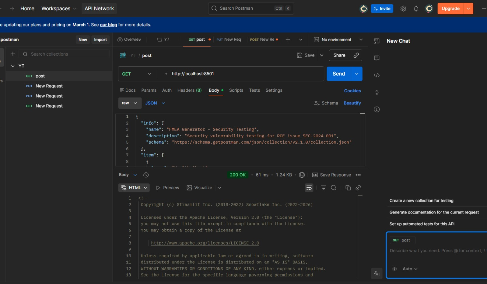
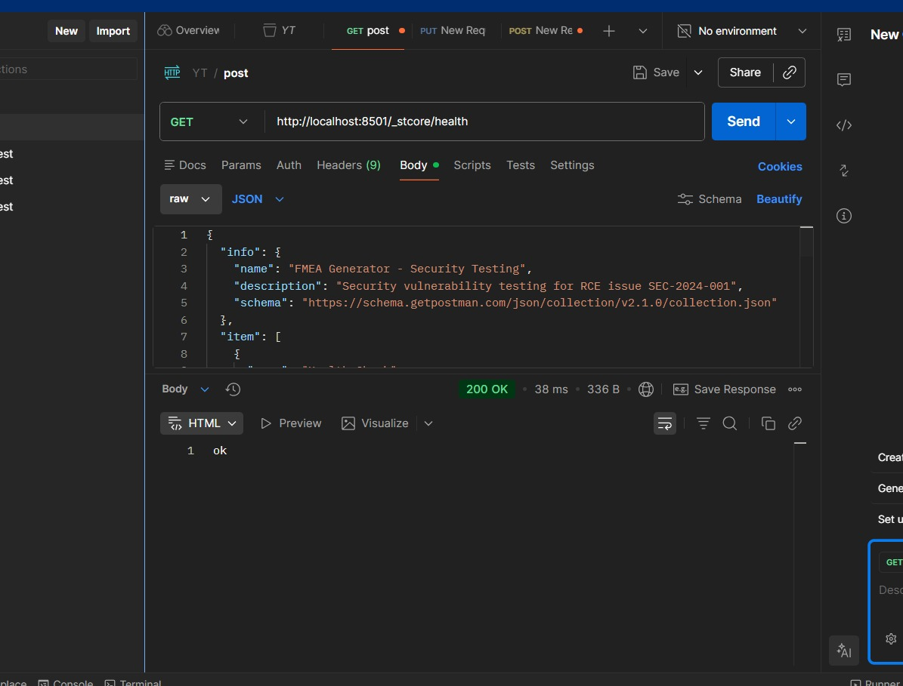
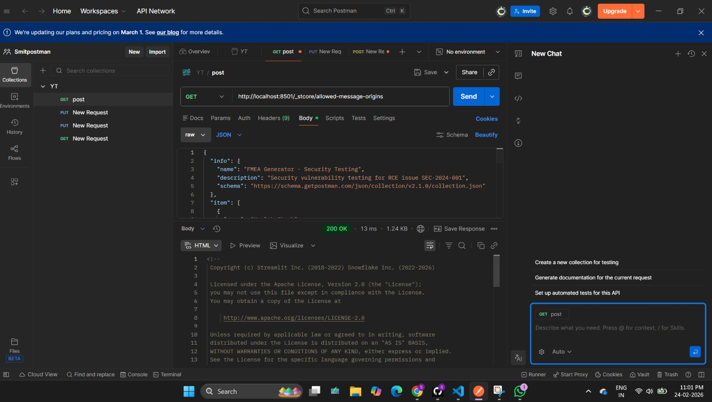

# Security Fix - SEC-2024-001

## What I Fixed

### Issue
Remote Code Execution vulnerability in model loading

### File Changed
`src/llm_extractor.py`

### Changes Made

**1. Line 93 & 108: Changed trust_remote_code**
python
# Before
trust_remote_code=True

# After
trust_remote_code=False

TRUSTED_MODELS = [
    'mistralai/Mistral-7B-Instruct-v0.2',
    'meta-llama/Llama-2-7b-chat-hf',
    'meta-llama/Llama-2-13b-chat-hf',
    'google/flan-t5-base',
    'google/flan-t5-large',
]

def _validate_model_name(self, model_name: str) -> bool:
    return model_name in self.TRUSTED_MODELS

if not self._validate_model_name(model_name):
    logger.error(f"Model not in whitelist")
    return

## API end point postman image 

